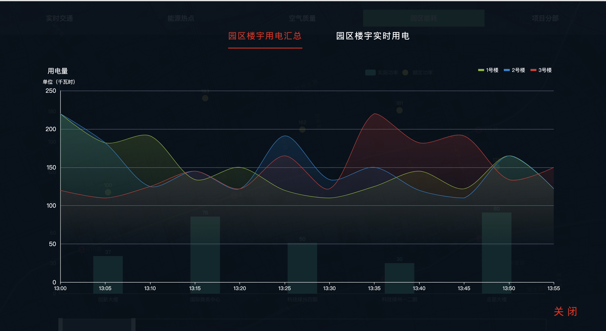

# 数据可视化

## [Live](https://vuedata.netlify.com)





## 主要功能

``` bash
实时路况：百度地图实时路况信息提供

能源热点:分园区能源用量向总部汇总

空气质量：园区空气质量监控

园区能源：园区能耗情况统计图，点击各园区能耗柱状图，查看该园区里楼宇的实时和历史能耗情况

项目分部：园区能耗改造分部情况
```


## Build Setup

``` bash
# install dependencies
npm install

# serve with hot reload at localhost:8080
npm run dev

# build for production with minification
npm run build

# build for production and view the bundle analyzer report
npm run build --report
```

